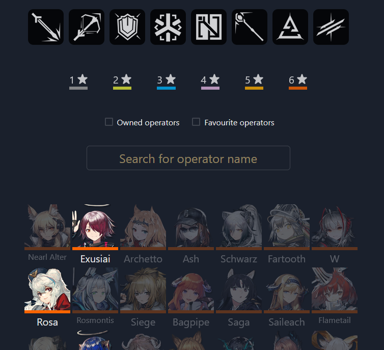
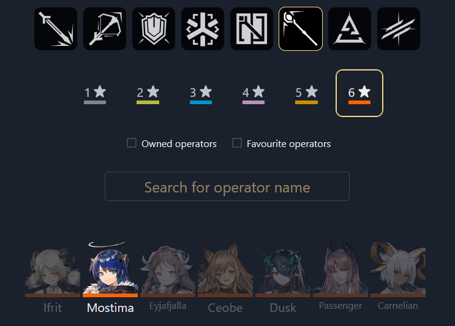
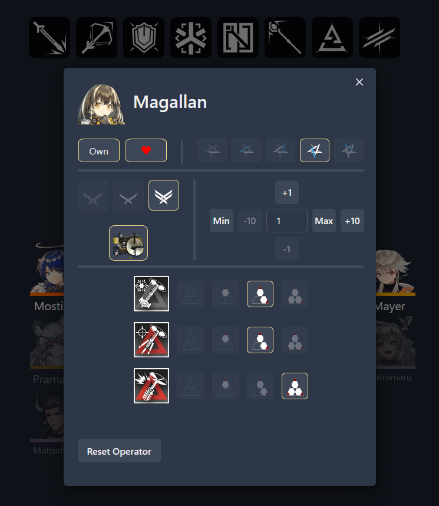

# Arknights Tracker
Link: [Arknights Tracker](https://arknights-tracker.surge.sh)
## Overview
Arknights is a strategy game where players use operators from their rosters to complete content.  
This web application is designed to help players keep track of their operators
## Features
- **Operator Grid**: Easily view and manage a list of operators owned by the user.
<p>
    &nbsp&nbsp&nbsp&nbsp
</p>

- **Filter**: Filter and operators based on various criteria such as class and rarity.
<p>
    &nbsp&nbsp&nbsp&nbsp
</p>

- **Operator Details**: User can set detailed information about each operator such as their current levels, equipment etc.
<p>
    &nbsp&nbsp&nbsp&nbsp
</p>

- **Data Persistence**: All operator data is stored and persisted in local storage.
## Technologies used
* **Bundler**: Webpack
* **Framework**: React/TypeScript
* **Linting and formatting**: ESLint, Prettier
* **Styling**: Chakra UI
## Setup

```sh
npm install
npm start
```

This will open a development server at [http://localhost:3000](http://localhost:3000).
